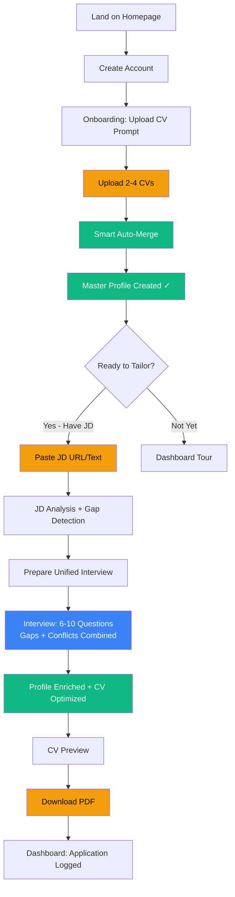

**Version 2.0 — Unified Interview Approach**

_Last updated: March 22, 2026_

Marcus
## Context Snapshot

|Attribute|Value|
|---|---|
|Profile completeness|0% — first-time user|
|Trust level|Skeptical — has tried generic CV builders before|
|Current situation|Recruiter reached out about senior QA role + saw Director posting|
|Time pressure|Moderate — not urgent, but doesn't want to spend 6 hours|
|Emotional baseline|Overwhelmed by experience breadth, tired of manual curation|
|Primary JTBD|"Extract the RIGHT regulatory experience for THIS specific role"|
|LTV potential|High (€100+) — will generate 5-10 CVs per active job search|

## Trigger

Marcus receives a LinkedIn message:

> "Hi Marcus, I'm recruiting for a **QA Manager, 21 CFR Part 11** role at a pharmaceutical company in Munich. Your background in blood bank IT and validation caught my eye. Do you have an updated CV?"

Marcus realizes:

1. His current CV emphasizes **GAMP 5 and MES validation** (from his last search)
    
2. The blood bank role was **8 years ago** — he hasn't highlighted it in years
    
3. He has **3 different CV versions** on his laptop, none current
    
4. Manually reformatting will take **4-6 hours**
    

He Googles: _"AI CV tailoring for pharma jobs Germany"_ → finds Apliqa.

## Happy Path Flow (REVISED)




## Step-by-Step Journey

### **Step 1: Landing & Signup**

Marcus lands on Apliqa homepage (SEO or LinkedIn ad), reads value prop, clicks **"Get Started"**, and creates account (email + password or SSO).

**Emotion:** Skeptical → Curious**Time:** 2 minutes

### **Step 2: CV Upload**

Onboarding screen appears:

> **"Let's build your Master Profile. Upload your existing CV(s) — we'll handle the rest."**_Upload 2-4 CVs for the richest profile. We'll automatically merge them._

Marcus uploads 3 PDFs:

- `CV_QA_Manager_2023.pdf` (emphasizes team leadership, CAPA, audits)
    
- `CV_Validation_2021.pdf` (emphasizes GAMP 5, CSV, IQ/OQ/PQ)
    
- `CV_IT_Compliance_2019.pdf` (emphasizes 21 CFR Part 11, LIMS, blood bank)
    

**System displays:** Upload progress bars → "Parsing CVs..." → "Analyzing data..."

**Emotion:** Curious → Hopeful**Time:** 3 minutes (upload + parsing)

### **Step 3: Smart Auto-Merge (Backend, Invisible to Marcus)**

The system:

1. **Extracts all data** from 3 CVs (positions, projects, skills, certifications)
    
2. **Auto-resolves 85-90% of conflicts** using intelligent heuristics:
    
    - Capitalization differences → Use most recent
        
    - Minor date overlaps (<1 month) → Accept as transition period
        
    - Duplicate projects with different wording → Merge into enriched single entry
        
    - Certifications present in one CV but not others → Add to Master Profile
        
3. **Flags ambiguous conflicts** (major title discrepancies, significant date conflicts, contradictory data)
    
4. **Stores flagged conflicts** in `master_profile.conflicts` (JSONB field) for later resolution
    

**Marcus sees:**

> ✅ **Master Profile Created!**
> 
> - 5 positions extracted
>     
> - 12 projects identified
>     
> - 3 certifications added
>     
> - 47 data points consolidated
>     
> 
> **Ready to tailor for a specific role?**[Yes — I have a job description] [Not yet — explore my profile]

**Emotion:** Impressed! _"Wow, that was instant. It actually worked."_**Time:** 30 seconds (feels instant to Marcus; processing happens during upload)

**KEY CHANGE:** No conflict resolution UI. No friction. Profile is **immediately usable**.

### **Step 4: Job Description Input**

Marcus clicks **"Yes — I have a job description"** and is prompted:

> **What role are you applying for?**Paste the job URL or job description text:

Marcus pastes the JD URL from the recruiter's LinkedIn message.

**System displays:** "Analyzing job description..." → "Detecting required skills..." → "Preparing your interview..."

**Emotion:** Engaged**Time:** 1 minute

### **Step 5: Unified Interview (Gaps + Conflicts Combined)**

**System presents:**

> **Let's tailor your CV for: QA Manager, 21 CFR Part 11**
> 
> We'll ask 8 questions to optimize your profile for this role. This will take about 6-8 minutes.Your answers will:✓ Fill knowledge gaps✓ Clarify experience details✓ Highlight your best-fit qualifications
> 
> [Start Interview]

**Interview flow (example questions):**

#### **Question 1 (Gap)**

> This role emphasizes **21 CFR Part 11 compliance**. Your blood bank position (2014-2016) involved electronic records systems.
> 
> Can you describe specific Part 11 validation work you led? (e.g., electronic signature systems, audit trail implementations)

**Marcus answers:** _(free text, 2-3 sentences)_

#### **Question 2 (Conflict + Gap, Job-Contextualized)**

> For your **2020-2023 position**, we found two titles in your CVs:• "QA Manager" (CV 2023)• "Senior QA Specialist" (CV 2021)
> 
> This role requires **team leadership experience**. Which title better reflects your management responsibilities? And how many direct reports did you have?

**Marcus responds:** "QA Manager is correct. I had 4 direct reports and managed the CSV program."

**System action:**

- Resolves conflict → Uses "QA Manager"
    
- Enriches profile → Adds "4 direct reports" and "CSV program ownership"
    
- **Dual benefit:** Conflict resolved AND profile strengthened for THIS role
    

#### **Question 3 (Gap)**

> The job description mentions **FDA audit experience**.
> 
> We noticed your 2019 CV references an "FDA audit (2021)"—can you describe your role in that audit and the outcome?

**Marcus answers:** _(details added to profile)_

#### **Question 4 (Conflict)**

> We found different end dates for your **Roche position**:• December 2022 (CV1)• October 2022 (CV2)
> 
> Which is correct? Also, did you overlap with your BioNTech role (started Oct 2022), or was there a transition period?

**Marcus responds:** "December 2022 is correct. I had a 2-month transition with overlap for knowledge transfer."

**System action:** Resolves date conflict, adds context to Master Profile

#### **Question 5 (Gap)**

> This role requires **CAPA management** expertise.
> 
> Can you share an example of a complex CAPA you've owned? (Include: root cause, corrective action, outcome)

**Marcus answers:** _(example added as project in profile)_

#### **Question 6-8:** Additional gap questions based on JD requirements

**Progress shown throughout:** "Question 5 of 8 — Tailoring your CV for QA Manager role"

**Emotion:** Validated, Engaged_"These questions are SMART. They're helping me think about how to position my experience for THIS specific role. This feels productive."_

**Time:** 6-8 minutes

### **Step 6: CV Generation**

After interview completion:

> ✅ **Interview Complete!**Generating your tailored CV... (15 seconds)

**System:**

- Updates Master Profile with all interview answers
    
- Runs tailoring engine using enriched profile + JD
    
- Prioritizes 21 CFR Part 11 experience (blood bank work)
    
- Emphasizes "QA Manager" title and leadership
    
- Surfaces LIMS project from 2016
    
- Generates DACH-formatted CV
    

**Marcus sees CV preview in browser**

**Emotion:** Impressed → Confident_"Wait, this actually looks REALLY good. It surfaced my blood bank work from 8 years ago that I'd completely forgotten about. The positioning is perfect for this role."_

**Time:** 1 minute (review)

### **Step 7: Download & Complete**

Marcus clicks **"Download PDF"**

**System:**

- Generates PDF using WeasyPrint (ADR 006)
    
- Logs application in dashboard
    
- Shows confirmation: **"CV saved! Want to tailor for another role?"**
    

Marcus downloads PDF, reviews one more time, attaches to recruiter email.

**Emotion:** Delighted_"This took 20 minutes total, not 6 hours. And it's better than what I would've written manually. I'm using this for every application."_

**Time:** 1 minute

**Total journey time: ~18 minutes**

## Branching Scenarios

### **Branch A: Marcus Has No JD Yet**

**Flow:**

1. After Master Profile creation, Marcus clicks **"Not yet — explore my profile"**
    
2. Taken to dashboard showing:
    
    - Profile completeness: 82%
        
    - Suggested improvements (e.g., "Add certifications?")
        
    - "New Application" button for later
        
3. **Conflicts remain unresolved** — stored in backend, invisible to Marcus
    
4. When Marcus returns with a JD later, conflicts surface in interview **only if job-relevant**
    

**Design rationale:**

- No forced "cleanup" work without a goal
    
- Conflicts resolved in context when they matter
    
- Marcus can build profile once, use many times
    

**Emotion:** Satisfied → Returns when needed

### **Branch B: Low Match Score (<60%) — Extended Interview**

**Flow:**

1. After JD analysis, system detects significant gaps
    
2. Interview preview shows: **"10 questions (8-10 min) — this role requires depth in areas not fully covered in your profile"**
    
3. Interview includes:
    
    - 3-4 gap questions (critical missing experience)
        
    - 2-3 conflict questions (if job-relevant)
        
    - 4-5 enrichment questions (add detail to existing experience)
        
4. Post-interview: **"Match score updated: 56% → 74%. CV generated."**
    

**Design rationale:**

- Critical gaps justify longer interview
    
- Show progress: "Before: 56%, After: 74%" builds trust
    
- Marcus understands WHY he spent 10 minutes
    

**Emotion:** Concerned → Relieved_"Okay, the interview was longer, but I can see the match score improved. My chances are better now."_

### **Branch C: Too Many Conflicts (e.g., 4 CVs Uploaded)**

**Flow:**

1. Marcus uploads 4 CVs
    
2. System detects 15 conflicts during auto-merge
    
3. **Intelligent triage:**
    
    - Auto-resolves 8 low-priority conflicts
        
    - Flags 7 ambiguous conflicts
        
    - After JD analysis, only 3 are relevant to target role
        
4. Interview includes:
    
    - 5 gap questions
        
    - 3 job-relevant conflict questions
        
    - **Other 4 conflicts ignored** (deferred to future applications)
        

**Marcus sees:** "8 questions (6 min)" — not "15 conflicts to resolve"

**Design rationale:**

- Only surface what matters for THIS application
    
- Irrelevant conflicts stay in backend (resolved later if needed)
    
- Keeps interview focused and fast
    

**Emotion:** Engaged_"This is manageable. The questions make sense for the role."_

### **Branch D: CV Parsing Fails**

**Flow:**

1. Marcus uploads scanned PDF
    
2. System displays: **"We couldn't extract text from this file. Try uploading a Word doc or paste your CV text."**
    
3. **Fallback option:** "Or start from scratch — we'll guide you through a 10-minute interview to build your profile."
    
4. If interview chosen: Guided onboarding interview (positions → projects → skills → certifications)
    

**Design rationale:**

- Never dead-end
    
- Provide recovery path
    
- Interview-only onboarding is acceptable fallback
    

**Emotion:** Frustrated → Relieved_"Okay, at least there's a backup option."_

### **Branch E: Marcus Abandons Mid-Interview**

**State persistence (ADR 004):**

json

FileEditView

```json
{
  "flow_id": "marcus_qa_manager_abc123",
  "step": "interview",
  "interview_progress": {
    "questions_total": 8,
    "questions_answered": 4,
    "gaps_resolved": ["21_cfr_part_11", "fda_audit"],
    "conflicts_resolved": ["positions[2].title"],
    "conflicts_pending": ["positions[3].end_date", "certifications[0]"]
  },
  "updated_at": "2026-03-22T10:45:00Z"
}
```

**Resume flow:**

1. Marcus returns to dashboard
    
2. Card shows: **"Resume Application: QA Manager — 4 of 8 questions complete"**
    
3. Clicks "Resume"
    
4. Taken directly to Question 5 (no re-asking answered questions)
    
5. **Option to generate CV anyway:** "Complete interview for best results, or generate CV now with current data"
    

**Design rationale:**

- Never make users restart
    
- Preserve all progress
    
- Allow "good enough" CV generation even if interview incomplete
    

**Emotion:** Grateful_"Thank god it saved my progress. I can finish this later."_

## Emotional Journey (REVISED — No Negative Dip)

FileEditView

```prolog
[Skeptical]   →  Landing page promises (heard it before)
    ↓
[Curious]     →  "Multiple CV upload? That's different..."
    ↓
[Hopeful]     →  Uploading CVs, watching progress
    ↓
[Impressed]   →  "Master Profile created in 30 seconds?!"
    ↓
[Engaged]     →  Interview questions are smart and job-specific
    ↓
[Validated]   →  "It's highlighting my blood bank work because of Part 11"
    ↓
[Confident]   →  CV preview looks professional and well-targeted
    ↓
[Delighted]   →  "20 minutes total. Better than I could write manually."
    ↓
[Advocacy]    →  Texts colleague: "You NEED to try this tool"
```

**Critical achievement:** No dip to "Frustrated" or "Overwhelmed." Trust builds continuously.

## Conflict Resolution Patterns (Job-Contextualized)

### **Pattern 1: Position Title Conflict**

❌ **OLD (Generic):**

> "Which is correct: 'QA Manager' or 'Senior QA Specialist'?"

✅ **NEW (Job-Contextualized):**

> "This role requires 5+ years of team leadership. For your 2020-2023 position, should we emphasize 'QA Manager' (highlights leadership) or 'Senior QA Specialist' (highlights technical depth)?"

**Why better:** Helps Marcus make a STRATEGIC choice, not just "fix data"

### **Pattern 2: Date Overlap Conflict**

❌ **OLD (Accusatory):**

> "You have overlapping dates. Which CV is wrong?"

✅ **NEW (Framed as clarification):**

> "We noticed your Roche role (Oct 2022-Present) and BioNTech role (2020-Dec 2022) overlap slightly. Was this contract/consulting work, or should we adjust the dates? For this application, how should we position the transition?"

**Why better:** Assumes good faith; focuses on optimal presentation

### **Pattern 3: Missing Certification Conflict**

❌ **OLD (Bureaucratic):**

> "CV1 lists 'GAMP 5 Certified' but CV2 doesn't. Do you have this cert or not?"

✅ **NEW (Value-oriented):**

> "This role requires GAMP 5 expertise. One of your CVs mentions 'GAMP 5 Certified'—is this a formal certification, or practical experience? We'll highlight it prominently either way."

**Why better:** Doesn't punish discrepancy; focuses on leveraging it

## Touchpoint Inventory

|Screen/Component|Purpose|Marcus Interaction|Technical Reference|
|---|---|---|---|
|**Landing Page**|Value prop, SEO entry point|Read, click "Get Started"|Static marketing site|
|**Signup/Login**|Account creation|Email/password or SSO|POST /api/auth/register|
|**Onboarding Prompt**|CV upload instructions|Upload 2-4 CVs|POST /api/cv/upload (ADR 014)|
|**Upload Screen**|Drag-drop or file picker|Select files, confirm upload|Multipart form, progress bar|
|**Parsing Progress**|Real-time feedback|Wait, watch progress|WebSocket or polling /api/cv/{id}/status|
|**Auto-Merge (Backend)**|Invisible data consolidation|None — happens automatically|Backend merge logic (ADR 013)|
|**Profile Created Screen**|Success confirmation|Review summary, click "Tailor for role"|GET /api/profile/summary|
|**JD Input Modal**|URL or text entry|Paste JD URL/text, submit|POST /api/job/analyze|
|**Interview Intro**|Set expectations|Read estimate, click "Start"|GET /api/interview/{id}/intro|
|**Interview Chat UI**|6-10 questions, conversational|Answer free-text, submit each|POST /api/session/{id}/message|
|**Interview Progress**|Shows "Question X of Y"|Track progress|Client-side state|
|**CV Preview (iframe)**|WYSIWYG HTML preview|Scroll, review, click "Download"|GET /api/cv/{id}/html|
|**PDF Download**|Final artifact|Download, done|GET /api/cv/{id}/pdf|
|**Dashboard**|Profile status, applications, resume flows|Navigate, click "New Application"|GET /api/flow (list user flows)|
|**Resume Flow Card**|For abandoned interviews|Click "Resume" to continue|GET /api/flow/{id}/state|
|**Profile Completeness**|Optional enrichment suggestions|Click to see improvements|GET /api/profile/completeness|

## Design Principles

|Principle|Rationale|Implementation|
|---|---|---|
|**Value first, refinement later**|Show Marcus results before asking for work|Auto-merge with heuristics; conflicts resolved in interview, not upfront|
|**Job-contextualized questions**|Every question should reference the target role|Interview questions frame conflicts as optimization for THIS job|
|**Single value-creation step**|One focused activity that directly produces output|Unified interview (gaps + conflicts) → tailored CV|
|**Transparency builds trust**|Show Marcus exactly what's happening|Progress indicators, question context, "Match score: 54% → 71%" updates|
|**Never discard data**|Every CV has something valuable|Additive merge logic (ADR 013); conflicts flagged, not auto-deleted|
|**Conflicts = opportunities**|Frame as "help us optimize" not "fix your mistake"|Positive language, strategic framing|
|**Support exploration**|Not every user has a JD ready|Allow profile-only creation; defer conflicts until JD-driven interview|
|**State survives interruption**|Marcus might get pulled into meeting mid-session|Backend-stateful design (ADR 004); resume from any point|
|**Progressive interview length**|Longer interview justified only for critical gaps|4-6 questions if high match; 8-12 if <60% match; show why|
|**Intelligent triage**|Only surface job-relevant conflicts|Flag all conflicts, but interview only includes those relevant to target role|

## Technical Implementation Notes

### **Backend: Unified Interview Orchestrator**

python

FileEditView

```python
# Pseudo-code for interview preparation

def prepare_interview(master_profile, job_description, flagged_conflicts):
    """
    Combines gap detection with conflict resolution 
    into single job-contextualized interview
    """
    
    # Analyze gaps
    gaps = analyze_gaps(master_profile, job_description)
    
    # Filter conflicts for job relevance
    relevant_conflicts = filter_conflicts_by_job(
        conflicts=flagged_conflicts,
        job_requirements=job_description.requirements
    )
    
    # Build unified question queue
    questions = []
    
    # Add critical gap questions (high-priority)
    for gap in gaps.critical:
        questions.append({
            'type': 'gap',
            'priority': 'high',
            'question': format_gap_question(gap, job_description),
            'context': gap.jd_requirement
        })
    
    # Add job-relevant conflict questions (framed strategically)
    for conflict in relevant_conflicts:
        questions.append({
            'type': 'conflict',
            'priority': 'medium',
            'question': format_conflict_question(conflict, job_description),
            'context': conflict.job_framing,
            'options': conflict.conflicting_values
        })
    
    # Add moderate gap questions
    for gap in gaps.moderate:
        questions.append({
            'type': 'gap',
            'priority': 'medium',
            'question': format_gap_question(gap, job_description)
        })
    
    # Sort by priority, limit to 10-12 questions max
    questions = prioritize_and_limit(questions, max=12)
    
    return {
        'questions': questions,
        'estimated_time': len(questions) * 1.2,  # ~1.2 min per question
        'match_score_before': calculate_match(master_profile, job_description)
    }
```

### **Conflict Auto-Resolution Heuristics**

|Conflict Type|Auto-Resolution Rule|Confidence|Example|
|---|---|---|---|
|Capitalization difference|Use most recent CV's version|95%|"Qa Manager" vs "QA Manager" → "QA Manager"|
|Minor date overlap (<1 month)|Accept as transition period|85%|Ends Dec 2022 vs. starts Nov 2022 → Overlap accepted|
|Duplicate projects|Merge into enriched single entry|80%|"LIMS validation" + "LIMS IQ/OQ" → Combined|
|Missing cert in one CV|Add to Master Profile|75%|CV1 has "GAMP 5", CV2 doesn't → Add to profile|
|Job title synonyms|Flag for interview (job-dependent)|50%|"QA Manager" vs "Quality Manager" → Ask in interview|
|Significant date discrepancy|Flag for interview (>2 months difference)|30%|Ends Dec 2022 vs Oct 2022 → Requires clarification|
|Contradictory data|Flag for interview (cannot auto-resolve)|0%|"5 reports" vs "team lead (no reports)" → Must ask|

**Storage:**

json

FileEditView

```json
// master_profile.conflicts (JSONB field)
{
  "conflicts": [
    {
      "id": "conf_001",
      "field": "positions[2].title",
      "values": ["QA Manager", "Senior QA Specialist"],
      "source_cvs": ["cv_2023.pdf", "cv_2021.pdf"],
      "priority": "medium",
      "job_relevant": true,  // Set during JD analysis
      "status": "flagged",
      "resolution_strategy": "ask_in_interview_with_job_context"
    },
    {
      "id": "conf_002",
      "field": "positions[3].end_date",
      "values": ["2022-12-31", "2022-10-31"],
      "source_cvs": ["cv_2023.pdf", "cv_2021.pdf"],
      "priority": "low",
      "job_relevant": false,  // Not relevant to current JD
      "status": "deferred",
      "resolution_strategy": "defer_to_future_application"
    }
  ]
}
```

## Open Questions (UPDATED)

| #   | Question                                                         | Resolution                                                                                                                                    | Status     | Owner |
| --- | ---------------------------------------------------------------- | --------------------------------------------------------------------------------------------------------------------------------------------- | ---------- | ----- |
| 1   | ~~Merge conflict UI: Separate screen vs interview integration?~~ | **RESOLVED: Conflicts handled in unified interview**                                                                                          | ✅ Closed   | —     |
| 2   | **Max CV upload limit?**                                         | Cap at 4 CVs for V1 (diminishing returns beyond that), including th LinkedIn or similar profiles in PDF format                                | Close      | Jason |
| 3   | **Generic conflict handling if no JD?**                          | Generate option to enhance profile on dashboard. Factual conflicts + enrichment gaps ONLY                                                     | **Closed** | Jason |
| 4   | **Max interview length?**                                        | 10-12 questions max; show estimated time upfront                                                                                              | Open       | Jason |
| 5   | **Partial interview recovery?**                                  | Show open gaps next to CV - allow user to select gaps to tackle. If user needs to disconnect and return later, remaining gaps can be tackled. | Closed     | Carla |
| 6   | **Auto-resolution confidence threshold?**                        | Only auto-resolve if confidence >75%; otherwise flag for interview                                                                            | Open       | Carla |
| 7   | **Conflict question templates?**                                 | Need standardized templates for common conflict types                                                                                         | Open       | Jason |
| 8   | **Multi-device interview resume?**                               | Can Marcus start on desktop, finish on mobile?<br>RESOLVED: Stay desktop only for MVP                                                         | Closed     | Carla |

## Success Metrics

|Metric|Target|Measurement|
|---|---|---|
|**Time to first CV**|<25 minutes (including interview)|Track from signup to PDF download|
|**Interview completion rate**|>85%|% of users who finish interview once started|
|**Interview abandonment point**|<10% drop-off before Question 5|Track question-by-question completion|
|**CV quality satisfaction**|>4.2/5.0|Post-download survey: "How accurate is this CV?"|
|**Return rate**|>60% within 30 days|% of users who generate 2+ CVs|
|**Match score improvement**|Average +15-25 points|Track before/after interview score change|
|**Conflict resolution accuracy**|>95% user satisfaction|Survey: "Did we resolve CV discrepancies correctly?"|