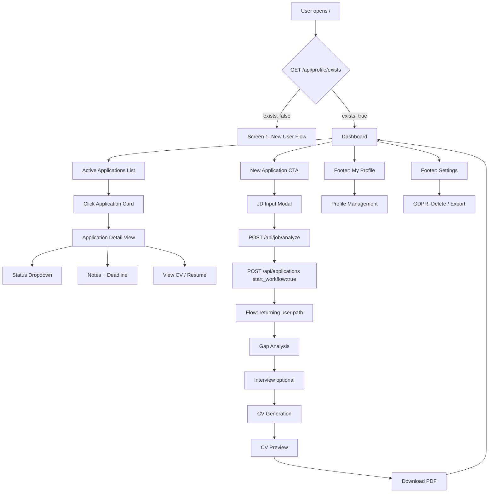

# Sprint 7 — Iteration 21: Dashboard, Returning User Flow & Application Pipeline

**Version:** 1.0
**Datum:** 31. März 2026
**Status:** In Planung
**Branch:** sprint-7

---

## Ziel

Lieferung der Emma-Power-User-Erfahrung: Dashboard mit aktiven Applikationen, Returning-User-Fast-Path (CV-Upload überspringen, direkt zur Gap-Analyse), Application-Tracking mit benutzerverwalteten Status und GDPR-Self-Service-Oberfläche.

## Phasen

### Phase 1: Backend API Erweiterungen (Tasks 21.11, 21.10, 21.12, 21.14)

#### Task 21.11: GET /api/profile/exists Endpoint

**Zweck:** Lightweight Check für Profil-Existenz und completeness_score — benötigt für Routing-Entscheidung (neuer User → Screen 1 vs. returning User → Dashboard).

**Änderungen:**

1. **Neuer Router-Endpoint** in [`backend/apliqa/routers/profile.py`](backend/apliqa/routers/profile.py):
   ```python
   @router.get("/exists")
   async def profile_exists(
       db: AsyncSession = Depends(get_db),
       _auth: AuthProvider = Depends(get_auth_provider),
   ) -> dict:
       """Lightweight check: exists + completeness_score (no full profile payload)."""
   ```

2. **Service-Funktion** in [`backend/apliqa/services/profile.py`](backend/apliqa/services/profile.py):
   - Query `MasterProfile` für aktuellen User
   - Wenn vorhanden: `MasterProfileData.calculate_completeness()` aufrufen
   - Return: `{ exists: bool, completeness_score: float }`

3. **Kein Schema nötig** — einfaches dict-Response genügt.

---

#### Task 21.10: Application List Performance — N+1 Query Elimination

**Zweck:** `GET /api/applications` eager-loadet `job_analysis` und `flow_session` für <100ms bei 50 Applikationen.

**Änderungen:**

1. **[`backend/apliqa/services/application.py`](backend/apliqa/services/application.py)** — `list_applications()`:
   - `selectinload` für `job_analysis` und `flow_session` hinzufügen
   - Import: `from sqlalchemy.orm import selectinload`
   - Query anpassen:
     ```python
     stmt = (
         select(Application)
         .options(
             selectinload(...),  # job_analysis relation
             selectinload(...),  # flow_session relation
         )
         .where(...)
     )
     ```

2. **Response-Schema erweitern** in [`backend/apliqa/schemas/application.py`](backend/apliqa/schemas/application.py):
   - `ApplicationResponse` um `job_summary` (role_title, company_name) erweitern
   - Optional: `flow_summary` (current_step) hinzufügen

---

#### Task 21.12: Application Notes Search

**Zweck:** `q` Query-Parameter zu `GET /api/applications` für Volltextsuche über `role_title`, `company_name`, `notes`.

**Änderungen:**

1. **Router** [`backend/apliqa/routers/application.py`](backend/apliqa/routers/application.py):
   - `q: str | None = Query(default=None)` zu `list_pipeline()` hinzufügen
   - An `list_applications()` durchreichen

2. **Service** [`backend/apliqa/services/application.py`](backend/apliqa/services/application.py):
   - `list_applications()` um `q: str | None = None` erweitern
   - ILIKE-Filter hinzufügen:
     ```python
     if q:
         like = f"%{q}%"
         stmt = stmt.where(
             or_(
                 Application.role_title.ilike(like),
                 Application.company_name.ilike(like),
                 Application.notes.ilike(like),
             )
         )
     ```

---

#### Task 21.14: MCP Tool Updates

**Zweck:** `list_applications` und `get_application` MCP-Tools hinzufügen.

**Änderungen:**

1. **[`backend/apliqa/mcp/server.py`](backend/apliqa/mcp/server.py)**:
   - Zwei neue Tools hinzufügen:
     ```python
     @mcp.tool(description="List user's application pipeline.")
     async def list_applications(status_filter: str | None = None) -> list[dict]:
         ...

     @mcp.tool(description="Get details for a specific application.")
     async def get_application(application_id: str) -> dict:
         ...
     ```
   - Importe: `from apliqa.services.application import list_applications, get_application`

2. **MCP Tool Registry Dokument** aktualisieren (aus Iteration 17.15).

---

### Phase 2: Frontend Dashboard & Routing (Tasks 21.9, 21.1, 21.2)

#### Task 21.9: Routing & Navigation

**Zweck:** App Router Navigation für Dashboard, Flow, Profile, Settings.

**Änderungen:**

1. **[`frontend/app/page.tsx`](frontend/app/page.tsx)** — Root-Route wird zum Dashboard:
   - Beim Laden: `GET /api/profile/exists` aufrufen
   - Wenn `exists: false` → bestehende Screen 1 Logik anzeigen
   - Wenn `exists: true` → Dashboard-Komponente rendern

2. **Neue Routen erstellen:**
   - `frontend/app/profile/page.tsx` — Profile Management
   - `frontend/app/settings/page.tsx` — Settings mit GDPR

3. **Navigation-Komponente** erstellen:
   - `frontend/components/dashboard/Navigation.tsx` — Footer mit "My Profile", "Settings", "Help"

---

#### Task 21.1: Dashboard Screen

**Zweck:** Landing page für returning users.

**Komponenten:**

1. **Dashboard Header:**
   - "Welcome back, [name]" + Profile completeness pill badge
   - `GET /api/profile` für Name und completeness_score

2. **Application List Section:**
   - "Active Applications (N)"
   - `GET /api/applications` aufrufen
   - Application cards rendern

3. **Application Card:**
   - Role title, company name, applied date
   - Status badge (workflow-derived + user-managed)
   - Action buttons: "Resume", "View CV", "Resubmit"

4. **New Application CTA:**
   - Zentrierter Button unter der Liste
   - Öffnet JD-Input Modal

5. **Footer:**
   - "My Profile", "Settings", "Help" Links

**Dateien:**
- `frontend/components/dashboard/Dashboard.tsx`
- `frontend/components/dashboard/ApplicationCard.tsx`
- `frontend/components/dashboard/NewApplicationModal.tsx`

---

#### Task 21.2: Application Card Logic

**Zweck:** Status-Badges und kontext-sensitive Action buttons.

**Logik:**

| Workflow Status | Farbe | Badge Text |
|----------------|-------|------------|
| analyzing | teal (#2A8F9D) | "Analyzing" |
| interviewing | teal (#2A8F9D) | "Interviewing" |
| cv_generating | teal (#2A8F9D) | "Generating CV" |
| completed | green (#22c55e) | "CV Ready" |

| User Status | Farbe | Badge Text |
|-------------|-------|------------|
| tracking | gray | "Tracking" |
| applied | blue | "Applied" |
| rejected | red | "Rejected" |
| offer | green | "Offer" |

**Action Buttons:**
- "Resume" — wenn Flow unvollständig (`workflow_status != completed`)
- "View CV" — wenn `generated_cv_id` existiert
- "Resubmit" — wenn CV abgelaufen oder neu generieren gewünscht

**Dateien:**
- `frontend/components/dashboard/StatusBadge.tsx`
- `frontend/components/dashboard/ActionButtons.tsx`

---

### Phase 3: Application Pipeline (Tasks 21.3, 21.4, 21.5, 21.6)

#### Task 21.3: New Application Flow (Returning User)

**Zweck:** "New Application" → JD Input nur (kein CV Upload) → Gap Analysis direkt.

**Änderungen:**

1. **New Application Modal:**
   - JD Input (URL oder Text)
   - Submit → `POST /api/job/analyze`
   - Dann `POST /api/applications { job_analysis_id, start_workflow: true }`

2. **Backend:** Flow Orchestrator erkennt `user_type: "returning"` → überspringt `cv_import` → geht direkt zu `gap_analysis`.

**Dateien:**
- `frontend/components/dashboard/NewApplicationModal.tsx`

---

#### Task 21.4: Application Detail View

**Zweck:** Erweiterte Ansicht einer Applikation.

**Inhalt:**
- Role title, company
- Gap analysis summary
- Interview transcript (falls vorhanden)
- Generated CV link
- User notes field
- Deadline picker
- Status dropdown

**Dateien:**
- `frontend/app/applications/[id]/page.tsx`
- `frontend/components/application/DetailView.tsx`

---

#### Task 21.5: Status Management

**Zweck:** User-managed status dropdown + deadline picker.

**Änderungen:**
- Dropdown: Tracking → Applied → Rejected/Offer
- `PATCH /api/applications/{id} { user_status, notes, applied_at, deadline }`
- Countdown auf Card ("3 days left")

**Dateien:**
- `frontend/components/application/StatusDropdown.tsx`
- `frontend/components/application/DeadlinePicker.tsx`

---

#### Task 21.6: Delete Application

**Zweck:** Applikation löschen mit Bestätigung.

**Änderungen:**
- Trash icon auf Desktop, Swipe-to-delete auf Mobile
- Bestätigungsdialog: "Remove [role_title] from your pipeline?"
- `DELETE /api/applications/{id}`
- Card animiert raus

**Dateien:**
- `frontend/components/application/DeleteConfirmDialog.tsx`

---

### Phase 4: Profile & GDPR (Tasks 21.7, 21.8, 21.13)

#### Task 21.7: Profile Management Screen

**Zweck:** Editierbare Master Profile sections.

**Inhalt:**
- Personal Info, Work History, Skills, Education, Languages, Certifications
- Jede Section: collapsible card mit edit button
- Edit mode: fields werden editierbar, save ruft `PATCH /api/profile/{section}`
- Completeness gauge oben
- Enrichment history timeline

**Dateien:**
- `frontend/app/profile/page.tsx`
- `frontend/components/profile/SectionCard.tsx`
- `frontend/components/profile/CompletenessGauge.tsx`
- `frontend/components/profile/EnrichmentTimeline.tsx`

---

#### Task 21.8: GDPR Self-Service

**Zweck:** "Delete All My Data" und "Export My Data".

**Änderungen:**
- "Delete All My Data" — roter Button, Bestätigung mit getipptem "DELETE"
- `DELETE /api/profile`
- "Export My Data" — `GET /api/profile/export` → JSON download

**Dateien:**
- `frontend/app/settings/page.tsx`
- `frontend/components/settings/GDPRSection.tsx`

---

#### Task 21.13: GDPR Cascade Verification

**Zweck:** Integration tests für DELETE und Export.

**Tests:**
- `DELETE /api/profile` — verify cascade: applications, flow_sessions, interview_sessions, generated_cvs, uploaded_files soft-deleted
- `GET /api/profile/export` — returns complete user data

**Dateien:**
- `tests/integration/test_sprint7_gdpr.py`

---

## Architektur-Diagramm



## API-Übersicht

| Endpoint | Methode | Zweck | Status |
|----------|---------|-------|--------|
| `/api/profile/exists` | GET | Profil-Existenz check | Neu |
| `/api/applications` | GET | Pipeline listen (mit q-Suche) | Erweitert |
| `/api/applications` | POST | Job zu Tracking hinzufügen | Bestehend |
| `/api/applications/{id}` | GET | Detail mit Flow-State | Bestehend |
| `/api/applications/{id}` | PATCH | Status, Notes, Deadline | Bestehend |
| `/api/applications/{id}` | DELETE | Soft-delete | Bestehend |
| `/api/profile` | DELETE | GDPR Löschung | Bestehend |
| `/api/profile/export` | GET | GDPR Export | Bestehend |

## Done When

1. Returning user öffnet `localhost:3000` → sieht Dashboard mit vorherigen Applikationen
2. "New Application" → JD pasten → Gap Analysis in <60s (kein CV Upload)
3. Application cards zeigen korrekte Status-Badges und Action buttons
4. Status dropdown updates persistieren
5. Notes und Deadline editierbar und gespeichert
6. Profile screen zeigt alle Sections, inline editierbar
7. "Delete All My Data" löscht alles, "Export My Data" lädt JSON herunter
8. Full E2E: New user completes Sprint 4-6 flow → returns → Dashboard shows application → starts second application → fast path works
